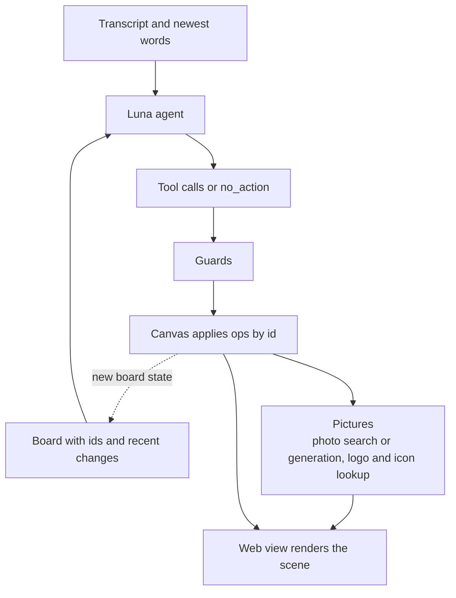
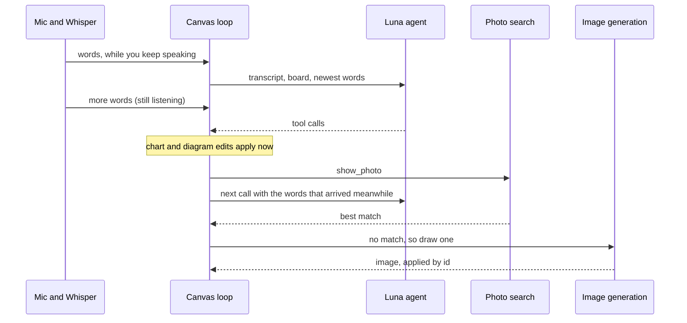

# How AdLib works

## Flow

The agent runs whenever it is idle and new words have arrived.

- **One decision maker.** The agent (Luna) chooses what to show. There are no keyword rules or routing tables in
  the main path, so it follows natural speech instead of fixed phrases.
- **Rust owns the state.** The web view renders the whole scene each time and animates changes between layouts.
- **Ops are addressed by id.** An answer still applies if the board changed while the model was thinking. If the
  target is gone, the op is refused and logged.

## What runs in parallel

Nothing on the critical path waits for anything else.

- **Listening is separate.** Whisper runs on its own thread and streams words to the canvas loop, so transcription
  continues while the agent thinks.
- **The agent runs in the background.** Words that arrive during a call are merged into the next one instead of
  being dropped.
- **Pictures are fetched off to the side.** Photo search and image generation run as background tasks, several can be
  in flight at once, and each result is applied by id when it arrives. The board never waits for them.
- **Startup work overlaps.** The image generator is woken in the background while the models load and the agent
  connection is prepared.
- Ops themselves are applied one at a time by the canvas, in order, which keeps the board state deterministic.

## The board

- Up to 4 tiles: photo, logo or icon, chart, diagram, text. Only one text tile at a time. The oldest tile is
  evicted when a fifth arrives.
- Layouts: `auto` (1 full, 2 side by side, 3 hero plus 2, 4 grid), `hero`, `compare`, `grid`.
- Zoom is `focus`: the focused tile becomes the hero. A lone tile scales up instead.
- Annotations: one circle per tile (all four can be circled), up to 3 arrows between different tiles.

## What the agent can do

| Tools | Purpose |
|---|---|
| `show_photo` | A photo of a real-world thing. Searched in the library, generated if nothing matches. |
| `show_logo`, `show_icon` | A company or product logo, a generic icon or a country flag, found by name. No match gives a plain name card. |
| `draw_chart`, `set_point`, `add_point`, `remove_point`, `set_chart` | Create a chart, correct one value, add or drop a point, change kind, title or unit. Points are addressed by label. |
| `draw_diagram`, `add_nodes`, `update_node`, `remove_node`, `add_edge`, `remove_edge` | Create and edit flows, cycles, hubs, timelines and architecture diagrams. |
| `draw_text`, `add_text_blocks`, `update_text_block`, `remove_text_block` | A card of headings, paragraphs and bullets. Each block underlines 1 or 2 key phrases. |
| `focus`, `arrange`, `annotate`, `clear_annotations` | Zoom, layout, circles and arrows. |
| `remove`, `clear_board` | Take a tile away, or clear the board. |
| `no_action` | Nothing to do. The reason is logged. |

## Guards

The model judges the language. The code checks the evidence.

- **Removals need a quote.** `remove`, `clear_board` and the `remove_*` tools must include the exact words the
  presenter said, and those words must appear in the newest speech.
- **Chart values must be spoken.** A number has to be in what the presenter said, or already on the board.
- **Corrections must look like corrections.** `set_point` needs the presenter to correct a value or name the
  quantity, and cannot swap units.
- **Text waits for a finished sentence.** Partial speech can trigger other tools but never visible text.
- **Wrong is worse than nothing.** A weak logo match becomes a name card. Icons that do not match well are left off.

## Photos, logos and icons

- **Photos:** the agent names a subject, which is embedded with CLIP and matched against about 39,000 photos. A
  match must clear a score threshold. If nothing does and the subject is still current, an image is generated and
  cached. Logos, icons, charts and vague subjects are never generated.
- **Logos and icons:** looked up by name, alias and tags in a library of about 13,000 SVGs (Iconify sets), with no
  embeddings. Monochrome icons are re-inked to suit the theme.
- **When a symbol appears is the agent's call.** A technology or company the talk is about gets its logo, even if
  the presenter does not ask. It skips names already on screen, comparisons, words used in an ordinary sense
  ("an apple") and companies given figures (those become charts, with logos on the bars).
- **On diagrams and charts:** nodes and chart points can carry a logo (for a named product) or one of 141 generic
  icons, all from one icon set so the style stays consistent. Pictures appear on most nodes or on none.

## Diagrams, charts and text

- Diagrams hold up to 10 nodes and charts up to 8 points. Omitted edges mean a chain (flow, timeline), a chain with
  a closing edge (cycle) or spokes (hub). Technical diagrams use explicit, labelled edges for every connection.
- A redraw that shares at least half its nodes with a diagram on screen replaces it in place. The same chart title
  replaces that chart's data.
- Layout is layered, with crossing reduction, curved edges and edge labels placed in gaps that touch nothing else.
- Text is measured in the font it is drawn in. It wraps by word, shrinks before splitting a word and only truncates
  as a last resort. A diagram gets one text scale so nothing clips.

## Rendering

- `app/dist/sketch.js` draws every tile as SVG. Strokes are seeded per element, so a graphic never re-wobbles.
  Only new nodes, bars and points animate.
- Themes: `sketch` (paper, hand-drawn, taped polaroids, macOS handwriting fonts) and `slate` (dark, clean lines).
- Preview without the app: serve the repo root, open `/app/dist/index.html` and call `demo.charts()`,
  `demo.diagrams()`, `demo.board()` and so on from the console.
- Visual check: `python3 scripts/preview_scene.py scripts/preview/text_cases.py <out-dir> --theme both` renders
  hard cases in headless Chrome and reports clipped, overlapping or split text.

## Backends and configuration

Both backends get the same tools and prompt.

| | OpenAI (`OPENAI_API_KEY`) | OpenRouter (`OPENROUTER_API_KEY`) |
|---|---|---|
| Model | `gpt-5.6-luna` | `openai/gpt-5.6-luna` |
| Transport | Persistent Responses WebSocket, falling back to HTTP | Chat Completions |

With both keys set, OpenAI is used. `CANVAS_PROVIDER=openrouter` forces OpenRouter.

| Setting | Meaning |
|---|---|
| `CANVAS_MODEL` | Override the model |
| `CANVAS_TRANSPORT` | `http` disables the WebSocket |
| `AGENT_RPM` | Cap on agent calls per minute |
| `LS_ASSETS` | Root of the photo and icon library |
| `BASETEN_API_KEY` | Enables generated images |
| `TAU` | Lowest photo score accepted |
| `LS_THEME` | `sketch` or `slate` |
| `LS_SOURCE` | `mic:<name>` or `wav:<file>` |
| `LS_FULLSCREEN`, `LS_DISPLAY` | Full screen and which monitor |

Without any key, a small offline rule set still handles layout cues ("compare", "zoom in on", "circle this") and
photos after a cue like "here's" or "take a look at".

Every run writes `logs/run-<time>.jsonl`: transcript chunks, each agent call and what was applied or refused, photo
searches, and the board after each change.

## Testing

- `cargo run -p ls-agent --bin ls-agent-probe -- --runs 3` runs speech-to-board cases against the real model. See
  [probes/luna/README.md](probes/luna/README.md).
- `./target/release/ls-replay fixtures/audio/luna-edit-talk.wav` replays a spoken talk headlessly. Then
  `python3 scripts/e2e_check.py logs/run-<time>.jsonl` checks nine board milestones.

## Known limits

- English only. Accents and noisy rooms increase transcription errors. Product names that Whisper mishears can be
  listed in `talk-terms.txt`.
- The transcript sent to the agent is capped, so very old speech is dropped.
- Only things in the libraries can be shown. Anything else is generated (photos) or shown as a name card (logos).
