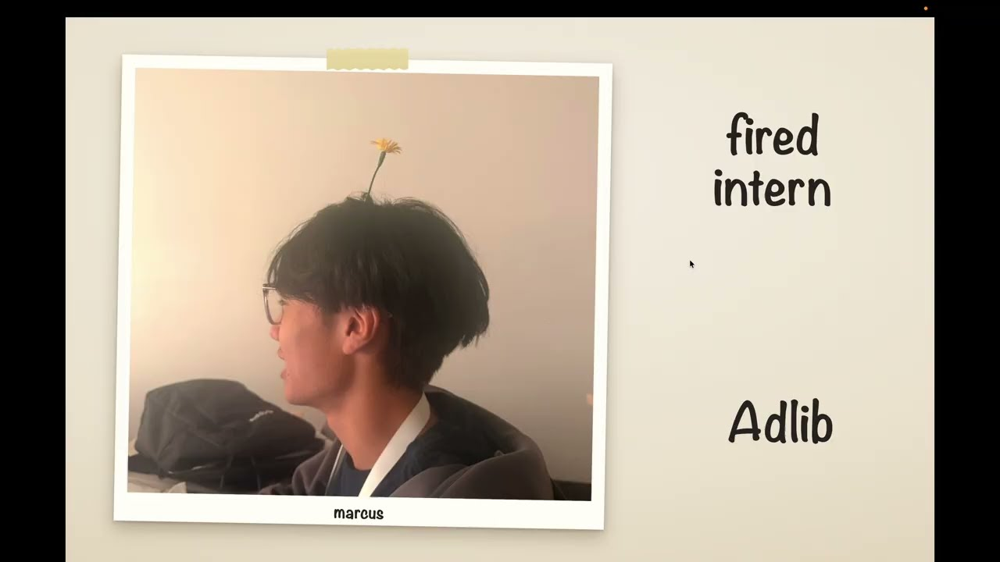
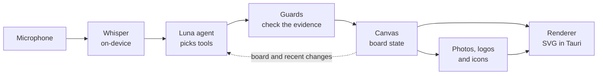

# AdLib

**Won $10k cash and was a semi-finalist at Hack the North 2026. Won the Rox Best AI Agent prize track.**

**The best way to present new ideas on the spot. No more slides you follow. AdLib follows you.**

AdLib listens to your voice and builds the visuals as you speak: flow charts, diagrams, graphs, photos, logos and
text. If you correct yourself mid-sentence ("sorry, it was forty-eight percent, not forty-six"), the graphic
updates in place. No slides, no clicking, no prompting. You just talk.

## Demo

<a href="https://www.youtube.com/watch?v=7rFWjY7Ly7k">
  
</a>

[Devpost](https://devpost.com/software/living-canvas-gz360v) submission here.

## What it does

- **Charts from your numbers.** Say the figures and get a bar, line or pie chart. Only numbers you actually said
  are charted.
- **Diagrams from your explanation.** Describe steps and you get a flow. Say it loops and it becomes a cycle.
  Describe a system and you get an architecture diagram with real logos on the nodes.
- **Live edits.** Corrections, additions, renames and removals change what is already on screen instead of
  redrawing it.
- **Logos, icons and flags.** Mention a company or technology and its logo appears. Over 13,000 symbols.
- **Photos.** Mention a thing and a matching photo appears, from a library of about 39,000 photos. If there is no
  match, one is generated.
- **Text.** Lists, section headings and takeaways become a clean text card with key phrases underlined.
- **Layout control.** Compare, zoom, circle and remove, all by speaking.
- **Hand-drawn look.** Sketched charts and diagrams that draw themselves in, on paper. A clean dark theme is also
  included.

## Things to try

AdLib understands natural speech, so there is nothing to memorize. These are common things to try:

| Say something like | You get |
|---|---|
| "Forty-six percent had nobody to go with, thirty-two percent didn't know where to start." | A chart |
| "Sorry, that first number was forty-eight." | That one bar updates |
| "In week five we hit one hundred three." | A new point on the same chart |
| "First we record audio, then transcribe it, then decide what to draw." | A flow diagram, one step per sentence |
| "And it all runs in a loop." | The flow becomes a cycle |
| "The API talks to Postgres and Kafka, and Kafka feeds Spark." | An architecture diagram with logos |
| "We wrote the backend in Python." | The Python logo |
| "There are three lessons. First, start with users." | A text card |
| "Penguins are great swimmers." | A penguin photo |
| "Let's compare those. Zoom in on the owl. Notice the eyes." | Side by side, zoomed, circled |
| "Take the eagle away." or "Let's move on." | A tile removed, or a clean board |

## How it works



1. **Hear.** Speech is transcribed on-device while you talk, so the agent sees words as you say them.
2. **Decide.** One agent reads the transcript and the current board, then calls tools to draw, edit, remove or
   rearrange. It does nothing when there is nothing to do.
3. **Check.** Chart values must come from your speech. Removing or clearing requires your own words as proof.
4. **Draw.** The canvas applies the change and the renderer animates only what is new.

All of this runs in parallel. Listening never pauses while the agent thinks, and photo search and image generation
happen in the background, so the board never waits on them.

More detail is in [CANVAS.md](CANVAS.md).

## Tech stack

- **Rust** workspace, one crate per stage (`hear`, `agent`, `canvas`, `search`, `gen`, `pipeline`)
- **Tauri 2** desktop app, with a debug window showing the live transcript and decisions
- **Whisper** (`whisper-rs`, Metal) and **Silero VAD** for on-device speech recognition
- **GPT-5.6 Luna** through OpenAI or OpenRouter, using tool calling
- **CLIP ViT-B/32** on **Candle** for photo search
- **SDXL-Lightning** on **Baseten** for generated images
- **Vanilla JS and SVG** for the renderer, with custom text fitting and diagram layout
- **Iconify** sets for logos, icons and flags. **Open Images** and **COCO** for photos
- **Python** for the asset pipeline and test scripts

## Run it

Requires an Apple Silicon Mac, Rust and a microphone.

```bash
cp .env.example .env                       # add OPENAI_API_KEY (or OPENROUTER_API_KEY); BASETEN_API_KEY is optional
CARGO_BUILD_JOBS=2 cargo build --release
./scripts/make_app.sh                      # builds build/AdLib.app
```

You also need the Whisper and Silero models and a photo library under `models/`. Point `LS_ASSETS` at the asset
library, or build a small local one with `./scripts/make_dev_library.sh`.

```bash
./demo.sh airpods                                                           # live from a mic (or: builtin)
LS_SOURCE=wav:fixtures/audio/luna-edit-talk.wav ./target/release/adlib      # replay a recording
cargo run -p ls-agent --bin ls-agent-probe -- --runs 3                      # speech-to-board test cases
```

Stage keys: `f` full screen, `b` blank, `g` grid of everything shown. Useful settings: `LS_SOURCE`, `LS_THEME`
(`sketch` or `slate`), `LS_FULLSCREEN`, `LS_DISPLAY`, `CANVAS_MODEL`. Names Whisper mishears (for example
"Baseten") go in `talk-terms.txt`.

## More

- [CANVAS.md](CANVAS.md): design and reference
- [probes/luna/README.md](probes/luna/README.md): the speech-to-board test suite
